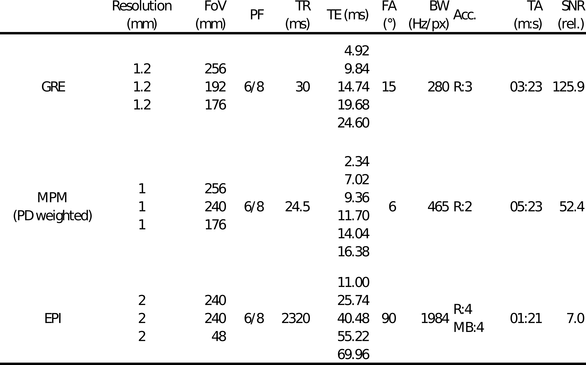
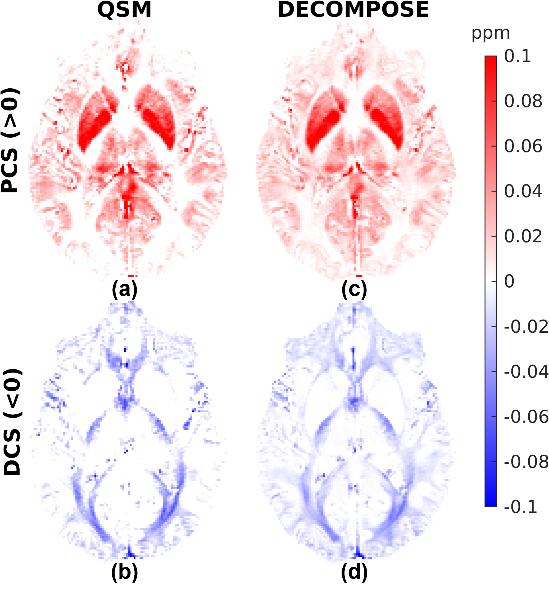
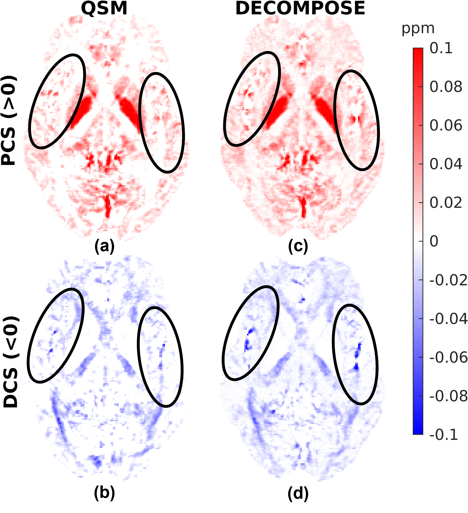
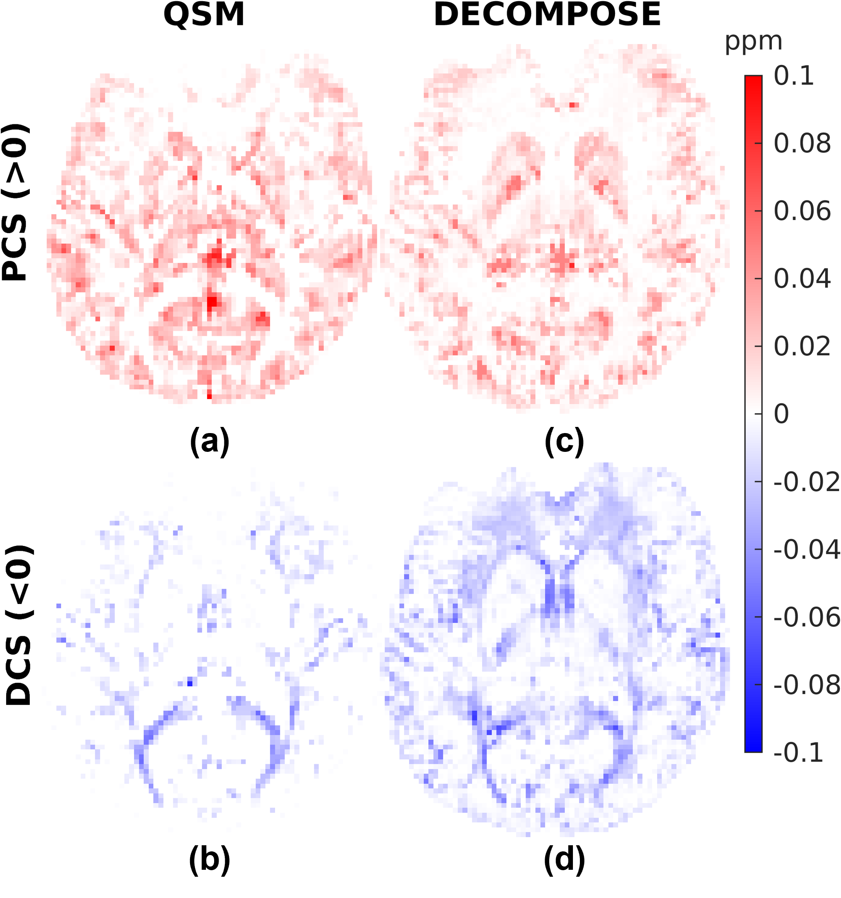
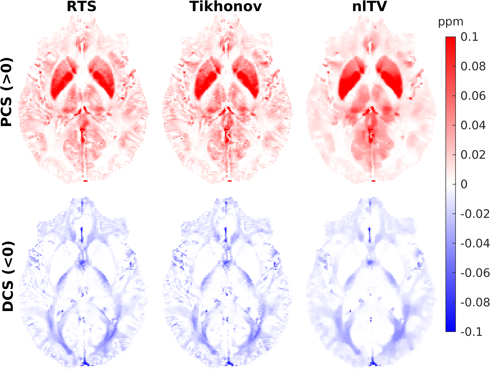

# RECOMPOSE -- Reproducing DECOMPOSE Using Susceptibility Maps Acquired for Clinical Research

Patrick Fuchs[1], Jingjia Chen[2,3], Oliver W Kiersnowski[1], Russel
Murdoch[1], Chunlei Liu[2,3], Karin Shmueli[1]

[1] *Medical Physics and Biomedical Engineering, University College
London, London, United Kingdom*

[2] *Electrical Engineering and Computer Sciences, University of
California, Berkeley, Berkeley, CA, United States,*

[3] *Helen Wills Neuroscience Institute, University of California,
Berkeley, Berkeley, CA, United States*

## Summary

To investigate the reproducibility and limits of DECOMPOSE, we applied
it to 3 clinically applicable sequences and tested its performance with
3 different dipole inversion algorithms. Good source separation was
observed with a 5-echo GRE sequence.

## Synopsis

Here, we reproduced the results of the DECOMPOSE susceptibility
separation model using new $T_2^*$-weighted data independently
acquired using three clinically applicable sequences and processed with
different QSM pipelines. This allowed us to investigate the sensitivity
of DECOMPOSE to various dipole inversion algorithms. Good susceptibility
source separation results were achieved using a 5-echo GRE acquisition,
but maps of diamagnetic and paramagnetic sources from a highly
accelerated 5-echo EPI sequence were noisy.

When the input susceptibility maps exhibited artefacts, these were
exacerbated by DECOMPOSE. Care must be taken not to lose local
structural information when using (highly) regularised input
susceptibility maps.

## Introduction

In quantitative susceptibility mapping (QSM) the goal is to reconstruct
bulk magnetic susceptibility values in tissue from the measured phase.
The susceptibility value in each voxel results from contributions from
para- and diamagnetic molecules. DECOMPOSE, a method to separate these
contributions based on fitting a three-compartment model to multi-echo
gradient recalled echo (GRE) data, was introduced at ISMRM 2021[1]. It
was then validated using a phantom, and successfully applied to high
signal-to-noise-ratio (SNR) 16-echo GRE data of in vivo acquisitions[2].
DECOMPOSE has since been shown to benefit susceptibility based
micro-structure detection[3]. This is the first application of DECOMPOSE
using accelerated clinically applicable sequences and outside the group
it was developed.

Here, we aimed to reproduce the DECOMPOSE results using new data,
acquired using shorter, more clinically applicable acquisitions with
fewer echoes. Our goal was to test DECOMPOSE\'s ability to separate
susceptibility sources in these lower signal-to-noise datasets with
minimal number of echoes, to test its sensitivity to different QSM
reconstruction algorithms used in the pre-processing pipeline, and to
reproduce the original results using different acquisition and
processing approaches.

## Methods

We applied DECOMPOSE in three different datasets acquired in healthy
volunteers as part of previous studies[4-6]: 1. a conventional 5-echo
3D-GRE, 2. a 7-echo multi-parametric mapping (MPM) sequence with short
echo times and only phase differences reconstructed[7], and 3. a highly
accelerated (low SNR) 5-echo 2D echo planar imaging (EPI) sequence. See
Figure 1 for detailed sequence parameters.

The 3D-GRE sequence (optimized for clinical QSM[8-10]) was used to
reproduce the original DECOMPOSE results with just 5 echoes (the
theoretical limit of the model). Sequences 2. and 3. were chosen as MPM
and EPI are often encountered in clinical research studies for
quantitative parameters or functional MRI, respectively.

Single-echo QSM for all echoes in all three datasets were generated
using the following QSM pipeline. A brain-mask was extracted using FSL
BET[11] (fractional intensity = 0.5). The phase images were unwrapped
using a Laplacian method[12, 13] and background fields were removed using
VSHARP ([18:-2:2] voxel kernel sizes, threshold of 0.05)(14), followed
by dipole inversion using a rapid two-step (RTS) approach with sparsity
priors (δ = 0.15, µ = 10^5, ρ = 10, and stopping tolerance =
$10^{-2}$)[17]. The processing pipeline can be found 
[here](https://github.com/UCL-MedPhys-MRI/RECOMPOSE). In the EPI data
slice-wise background field removal was applied[15], followed by PDF
($10^{-5}$ tolerance)(16) to remove residual background fields.

The DECOMPOSE algorithm was run with default values: five iterations,
diamagnetic susceptibility bounds of [-0.15, 0.05] and paramagnetic
bounds of [-0.05, 0.15] ppm. Several parameter variations were tried
after observing inferior performance on the MPM dataset despite it
having 7 echoes: DECOMPOSE was run with 10 iterations, then excluding
the low phase-CNR first echo.

To investigate the sensitivity of DECOMPOSE to the QSM dipole inversion
algorithm, DECOMPOSE was run on the 3D-GRE dataset with QSM
pre-processing with the pipeline described above but using non-linear
total variation [nlTV, λ=0.001](18), and Tikhonov [α=0.01](19)
regularizations with default regularisation weights.

The decomposed maps were then compared with a susceptibility map from
the (linearly combined) echoes, processed in the same way as the single
echoes.

Table 1: Overview of sequence parameters. SNR values are relative and computed for $T_1$ and $T_2^*$ values of 1600 and 55 ms respectively (relating to white matter[20,21]), for the first echo time. All scans were performed on a Siemens Prisma 3 T system. GRE and MPM sequences are 3D, and the EPI sequence is a 2D sequence (using a simultaneous multi-slice acquisition for multi-band acceleration).

## Results and Discussion

Figures 1, 2 and 3 show the DECOMPOSE maps from the GRE, MPM and EPI
datasets, respectively. Figure 1 (c, d) show good agreement of the
paramagnetic (PCS) and diamagnetic component of the susceptibility (DCS)
with the component maps in the original publication[2], with the DCS
showing more extensive white matter regions than the thresholded QSM.

Figure 1: GRE Thresholded Susceptibility and DECOMPOSE maps. The top row shows the positive thresholded QSM susceptibility (a) and paramagnetic component map (c), and the bottom row shows the negative thresholded QSM (b) and diamagnetic DECOMPOSE map (d).

Re-running DECOMPOSE on the MPM dataset with different parameters did
not noticeably improve the resulting maps, and those presented here used
the original parameters. The MPM DECOMPOSE maps in Figure 2 show
artefacts from the QSM reconstruction. This dataset features very short
echo spacing and only phase difference maps were reconstructed which
seems to result in artefacts around vasculature (highlighted in the
figure with black ovals) in the single echo maps, affecting the
performance of DECOMPOSE.

Figure 2: MPM Thresholded Susceptibility and DECOMPOSE maps. The top row shows the positive thresholded QSM susceptibility (a) and paramagnetic component map (c), and the bottom row shows the negative thresholded QSM (b) and diamagnetic DECOMPOSE map (d). lack ovals highlight streaking artefacts around vasculature, possibly caused by the phase-difference coil combination.

The EPI DECOMPOSE maps (Figure 3) appear noisier, possibly due to
distortion and residual background fields, but perhaps resulting from
the lower SNR, and larger echo spacing than the GRE and MPM.

Figure 3: EPI Thresholded Susceptibility and DECOMPOSE maps. The top row shows the positive thresholded QSM susceptibility (a) and paramagnetic component map (c), and the bottom row shows the negative thresholded QSM (b) and diamagnetic DECOMPOSE map (d).

Figure 4 features a comparison between the 3D-GRE DECOMPOSE maps using
three different QSM dipole inversion algorithms. It shows smoother para-
and diamagnetic susceptibility maps for nlTV when compared to Tikhonov
and RTS suggesting sub-voxel information is lost by regularisation in
nlTV, which cannot be recovered by DECOMPOSE.

Figure 4: GRE DECOMPOSE maps for different QSM dipole inversion methods, from left to right: rapid two step (RTS) [15], Tikhonov regularised [17], and non-linear TV [16] regularised.

# Conclusions

We reproduced DECOMPOSE maps similar to [2] with a shorter 5-echo GRE
sequence and a different QSM processing pipeline. Using MPM and EPI
sequences, the DECOMPOSE maps had noticeable artifacts and are of lower
quality overall. These issues seem to be related primarily to the lower
quality of input QSM maps, as the artefacts are also present in input
QSM images (and not in the magnitude images).

Additionally, our investigation into the sensitivity of DECOMPOSE to the
dipole inversion method used shows that susceptibility map
regularisation clearly affects the derived paramagnetic and diamagnetic
susceptibility maps.

The challenge of applying DECOMPOSE to faster sequences with fewer echo
times highlights the importance of optimising the QSM pipeline: both
minimising artefacts and preserving structural information when using
DECOMPOSE.

## Acknowledgements

Karin Shmueli and Patrick Fuchs were supported by European Research
Council Consolidator Grant DiSCo MRI SFN 770939.

# References

[1] Chen, J., et al., Decompose QSM to diamagnetic and paramagnetic
components via a complex signal mixture model of gradient-echo MRI data.
Proc of ISMRM 2021.

[2] Chen, J., et al. Decompose quantitative susceptibility mapping (QSM)
to sub-voxel diamagnetic and paramagnetic components based on
gradient-echo MRI data. Neuroimage 2021, [DOI](https://doi.org/10.1016/j.neuroimage.2021.118477).

[3] Chen, J. , et al., DECOMPOSE-STI: decompose sub-voxel diamagnetic
and paramagnetic susceptibility tensors. Proc of ISMRM 2022.

[4] Kiersnowski, OC, et al., The Effect of Oblique Image Slices on the
Accuracy of Quantitative Susceptibility Mapping and a Robust Tilt
Correction Method. Proc of ISMRM 2021.

[5] Murdoch, R., et al. A Comparison of MRI Quantitative Susceptibility
Mapping and TRUST-Based Measures of Brain Venous Oxygen Saturation in
Sickle Cell Anaemia. Front physiology, 2022, [DOI](https://doi.org/10.3389/fphys.2022.913443).

[6] Kiersnowski, O.C., et al., Simultaneous Multi-Slice Acceleration of
Multi-Echo EPI Provides Rapid and Accurate Quantitative Susceptibility
Mapping. Proc of ISMRM 2022.

7\. Robinson, S., et al., Combining phase images from multi-channel RF
coils using 3D phase offset maps derived from a dual-echo scan. Magn.
Reson. Med., 2011, [DOI](https://doi.org/10.1002/mrm.22753).

8 Biondetti, E, et al. Multi‐echo quantitative susceptibility mapping:
how to combine echoes for accuracy and precision at 3 Tesla. Magn Reson
Med. 2022, [DOI](https://doi.org/10.1002/mrm.29365).

[9] Karsa, A, et al., The effect of low resolution and coverage on the
accuracy of susceptibility mapping Magn Reson Med. 2019, [DOI](https://doi.org/10.1002/mrm.27542).

10 Haacke, E.M., et al., Quantitative susceptibility mapping: current
status and future directions, Magn Reson Med., 2015, [DOI](https://doi.org/10.1016/j.mri.2014.09.004).

[11] Smith, SM, Fast robust automated brain extraction. Human Brain
Mapping, 2002, [DOI](https://doi.org/10.1002/hbm.10062).

[12] Schofield MA, Zhu Y, Fast phase unwrapping algorithm for
interferometric applications. Optics letters, 2003, [DOI](https://doi.org/10.1364/OL.28.001194).

[13] Zhou D, et al., Background field removal by solving the Laplacian
boundary value problem. NMR Biomed. 2014, [DOI](https://doi.org/10.1002/nbm.3064).

[14] Wu B, et al., Whole brain susceptibility mapping using compressed
sensing. Magn reson med. 2012, [DOI](https://doi.org/10.1002/mrm.23000).

[15] Wei, H., et al. Joint 2D and 3D phase processing for quantitative
susceptibility mapping: application to 2D echo-planar imaging. NMR
Biomed., 2017, [DOI](https://doi.org/10.1002/nbm.3501).

[16] Liu T, et al., A novel background field removal method for MRI
using projection onto dipole fields. NMR Biomed. 2011, [DOI](https://doi.org/10.1002/nbm.1670).

[17] Kames C, et al., Rapid two-step dipole inversion for susceptibility
mapping with sparsity priors. Neuroim. 2018, [DOI](https://doi.org/10.1016/j.neuroimage.2017.11.018).

[18] Milovic C, et al., Fast nonlinear susceptibility inversion with
variational regularization. Magn reson med. 2018, [DOI](https://doi.org/10.1002/mrm.27073).

[19] Bilgic B, et al., Fast image reconstruction with L2‐regularization.
J. of magn reson imag. 2014, [DOI](https://doi.org/10.1002/jmri.24365).

[20] Peters, AM, et al., T2\* Measurements in Human Brain at 1.5, 3 and
7T. Proceedings of the 14[th] annual meeting of the ISMRM, 2006, p. 926.

[21] Wright PJ, et al., Water proton T1 measurements in brain tissue at
7, 3, and 1.5 T using IR-EPI, IR-TSE, and MPRAGE: results and
optimization. MAGMA. 2008 [DOI](https://doi.org/10.1007/s10334-008-0104-8).
